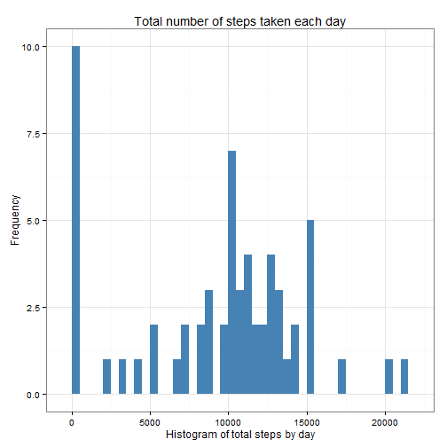
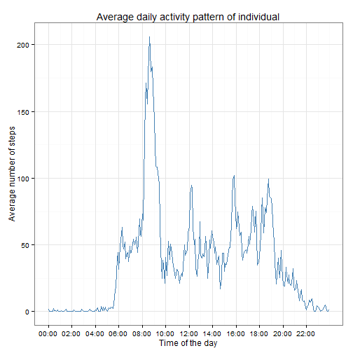
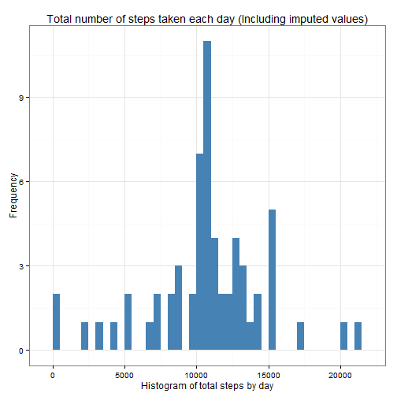
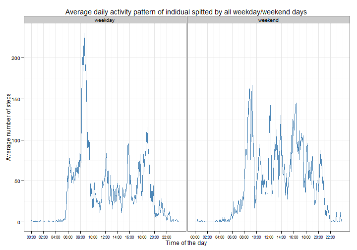

# Reproducible Research: Peer Assessment 1


```r
knitr::opts_chunk$set(fig.path = "figures/")
```

## Loading and preprocessing the data


```r
# Load libraries ---------------------------------------------------------------

library(dplyr)
library(ggplot2)
library(scales)
library(lubridate)

# Load data --------------------------------------------------------------------

activity_df <- read.csv('activity.csv')

# Pre-processing ---------------------------------------------------------------

# Transform date column from factor into Date format
activity_df <- mutate(activity_df,
                      date = as.Date(date)
                      )
```


## What is mean total number of steps taken per day?

For this part of the assignment, we ignore the missing values in the dataset.

The histogram below shows the total number of steps taken each day. 


```r
# Summarize steps taken by date
# (1) Group activities by date
# (2) Calculate total number of steps for each subgroup
activity_by_day_df <- group_by(activity_df, date) %>%
  summarize(
    total_steps = sum(steps, na.rm = TRUE)
    )

#plot histogram
ggplot(activity_by_day_df, aes(total_steps)) + 
  geom_histogram(fill = 'steelblue', binwidth = 500) +
  xlab('Histogram of total steps by day') +
  ylab('Frequency') +
  ggtitle('Total number of steps taken each day') +
  theme_bw() +
  theme(plot.title = element_text(size = rel(1.2))
        )
```

 

   

```r
paste0('The mean total number of steps taken per day is: ',
             round(mean(activity_by_day_df$total_steps, na.rm = TRUE),
             digits = 2))
```

```
## [1] "The mean total number of steps taken per day is: 9354.23"
```

```r
paste0('The median total number of steps taken per day are: ',
       median(activity_by_day_df$total_steps, na.rm = TRUE))
```

```
## [1] "The median total number of steps taken per day are: 10395"
```


## What is the average daily activity pattern?


The time series plot below shows the the average number of steps taken by an individual, averaged accross all days. 

In the original data the interval column is a numeric variable which represents the hour and minute of a day (110 corresponds to 01:10). 

This information could not be used directly for the x-axis variable plotting without any further pre-processing because it would have shown inappropriate distances between the sorted intervals. For instance, after 55 follows 100 in the sorted data where 55 represents 00:55 and 100 represents 01:00. Plotting this information on a continuous scale would mean an unnecessary big distance between 55 and 100 although the distance should be same as between 50 and 55 namely 5.

Therefore we introduce a new variable in the pre-processing steps below which represents the mintues after the starting time 00:00 for each interval. This variable is used as the x-axis variable ensuring that the time series is not skewed and that the distance between subsequent variables is always 5.


```r
# (1) Group activties by interval
# (2) Calculate average number of steps for each subgroup
# (3) Convert interval column from numeric to character to represent information
#     in desired time format (hour/minute: 01:45)
# (4) Add new column representing minutes from starting time 00:00 for each 
#     interval
activity_by_interval <- group_by(activity_df, interval) %>%
  summarize(
    average_steps = mean(steps, na.rm = TRUE)
    ) %>%
  mutate(
    hour_of_the_day = sprintf("%04d", interval),
    hour_of_the_day = paste0(substr(hour_of_the_day, 1, 2), ':', 
                             substring(hour_of_the_day, 3, 4)),
    minutes_from_starting_point = seq(0, length.out = length(interval), by = 5)
    )

ggplot(activity_by_interval, aes(minutes_from_starting_point, average_steps)) + 
  geom_line(color = 'steelblue') + 
  xlab('Time of the day') +
  ylab('Average number of steps') +
  ggtitle('Average daily activity pattern of individual') +
  scale_x_continuous(
     breaks = activity_by_interval$minutes_from_starting_point[seq(1, 288, by = 24)],
     labels = activity_by_interval$hour_of_the_day[seq(1, 288, by = 24)]
    ) +
  theme_bw()
```

 


At the following starting hour of the correspondent 5-minute interval, the indivdual takes the maximum average steps accorss all the days in the dataset:


```r
filter(activity_by_interval, average_steps == max(average_steps)) %>%
  select(interval, hour_of_the_day, average_steps)
```

```
## Source: local data frame [1 x 3]
## 
##   interval hour_of_the_day average_steps
## 1      835           08:35         206.2
```


## Imputing missing values

The total number of missing values in the dataset (i.e. the total number of rows with NAs) is the following:
    
    

```r
paste0('Total number of missing values: ',
       nrow(activity_df) - sum(complete.cases(activity_df))) 
```

```
## [1] "Total number of missing values: 2304"
```


For the 2304 observations with missing values in the steps column we will impute the average number of steps calculated for the respective 5-minute interval.  

We create a new dataset `complete_activity_df` that is equal to the original dataset but with the missing data filled in as follows:


```r
# Create new data frame based on the original data and the previously calculated
# average-steps-per-interval data frame. The new data frame corresponds to the
# original one but with an extra column showing the average number of steps for
# the respetive oberservation's interval 
complete_activity_df <- left_join(activity_df, 
                              select(activity_by_interval, interval, 
                                     average_steps), 
                              by = 'interval')

# Impute missing values with the average value of the respective 5-minute 
# interval
complete_activity_df$steps[is.na(complete_activity_df$steps)] <- 
  complete_activity_df$average_steps[is.na(complete_activity_df$steps)]
# Drop average_steps column
complete_activity_df$average_steps <- NULL
```


The histogram below shows the total number of steps taken each day for the modified dataset which includes the imputed values.  


```r
# Summarize steps taken by date
# (1) Group activities by date
# (2) Calculate total number of steps for each subgroup
comp_activity_by_day_df <- group_by(complete_activity_df, date) %>%
  summarize(
    total_steps = sum(steps)
    )

#plot histogram
ggplot(comp_activity_by_day_df, aes(total_steps)) + 
  geom_histogram(fill = 'steelblue', binwidth = 500) +
  xlab('Histogram of total steps by day') +
  ylab('Frequency') +
  ggtitle('Total number of steps taken each day (Including imputed values)') +
  theme_bw() +
  theme(plot.title = element_text(size = rel(1.2))
        )
```

 


Below you will find the mean and the median total number of steps taken per day for the data which includes the imputed values:


```r
paste0('The mean total number of steps taken per day is: ',
             round(mean(comp_activity_by_day_df$total_steps),
             digits = 2))
```

```
## [1] "The mean total number of steps taken per day is: 10766.19"
```

```r
paste0('The median total number of steps taken per day is: ',
       round(median(comp_activity_by_day_df$total_steps),
             digits = 2))
```

```
## [1] "The median total number of steps taken per day is: 10766.19"
```

Both the mean and the median are higher after using the imputed values in our calculation in comparison to the original data above.


## Are there differences in activity patterns between weekdays and weekends?


For this part of the assignement we will use the data set `complete_activity_df` which includes the imputed missing values. 

We will create a new factor variable `wday` in the dataset with two levels – “weekday” and “weekend” indicating whether a given date is a weekday or weekend day.
    
        

```r
# (1) Add new column to data frame which contains the days of the week encoded as
#     decimal numbers (01-07, Sunday is 1)
# (2) Transform numeric values of the wday to either 'weekend' or 'weekday'
# (3) Convert character vector to factor
complete_activity_df$wday <- wday(complete_activity_df$date)
complete_activity_df$wday[complete_activity_df$wday %in% c(7, 1)] <- 'weekend'
complete_activity_df$wday[complete_activity_df$wday != 'weekend'] <- 'weekday'
complete_activity_df$wday <- as.factor(complete_activity_df$wday)
```

The facetted time series plot below shows the average steps taken for each 5 minute-interval of the day averaged across all weekday/weekend days. The x-axis shows the time of the day instead of the numbers of the 5 minutes intervals to make the plot more understandable for a human reader (The same transformation as for the time series plot of question 2 was used here). 


```r
# (1) Group activties by weekday and interval
# (2) Calculate average number of steps for each subgroup
# (3) Convert interval column from numeric to character to represent information
#     in desired time format (hour/minute: 01:45)
# (4) Add new column representing minutes from starting time 00:00 for each 
#     interval
comp_activity_by_interval_df <- group_by(complete_activity_df, wday, interval) %>%
  summarize(
    average_steps = mean(steps)
    )  %>%
  mutate(
    hour_of_the_day = sprintf("%04d", interval),
    hour_of_the_day = paste0(substr(hour_of_the_day, 1, 2), ':', 
                             substr(hour_of_the_day, 3, 4)),
    minutes_from_starting_point = seq(0, length.out = length(interval), by = 5)
    )

ggplot(comp_activity_by_interval_df, aes(minutes_from_starting_point, 
                                         average_steps)) +
  geom_line(color = 'steelblue') +
  facet_wrap(~ wday) +
  xlab('Time of the day') +
  ylab('Average number of steps') +
  ggtitle('Average daily activity pattern of indidual spitted by all weekday/weekend days') +
  theme_bw() +
  theme(
    axis.text.x=element_text(size = 8) 
    ) + 
  scale_x_continuous(
    breaks = comp_activity_by_interval_df$minutes_from_starting_point[seq(1, 288, by = 24)],
    labels = comp_activity_by_interval_df$hour_of_the_day[seq(1, 288, by = 24)]
    )
```

 

